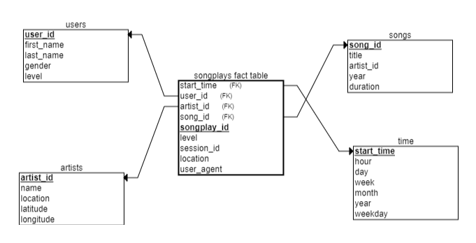

Project: Data Lake
-------------------------------------
Summary:
	Sparkify (music streaming startup) has grown their user base and song database and wants to move their processes and data from their data warehouse to a data lake.
	Relevant streaming data resides in S3, in a directory of JSON logs on user activity on the app, as well as a directory with JSON metadata on the songs in their app.
	
	The main golas of the project are as follows:
	1) Build an ETL (Extraction, Transformation and Load) pipeline that extracts data from S3
	2) Process data using Spark
	3) Loads data back into S3 as a set of dimensional tables
	4) Deploy this Spark process on a cluster using AWS

Dataset Location:
	Song data: s3://udacity-dend/song_data
	Log data: s3://udacity-dend/log_data

Output Location:
s3://project4-data/output_data/

Database Schema Design
------------------------
Fact Table: 
    songplays - records in log data associated with song plays i.e. records with page NextSong
	(Schema: songplay_id, start_time, user_id, level, song_id, artist_id, session_id, location, user_agent)

Dimension Tables:
    1) users - users in the app
       (Schema: user_id, first_name, last_name, gender, level)
    2) songs - songs in music database
       (Schema: song_id, title, artist_id, year, duration)
    3) artists - artists in music database
       (Schema: artist_id, name, location, latitude, longitude)
    4) time - timestamps of records in songplays broken down into specific units
       (Schema: start_time, hour, day, week, month, year, weekday)

Justification: The database was designed using Star schema because Star schema simplifies queries and can be used to perform fast aggregations/analytics

Explanations of Files and ETL Pipeline
----------------------------------------
	1) etl.py: reads data from S3, processes that data using Spark, and writes them back to S3 (to the relevant locations)
	2) README.md: provides discussion on process and decisions
	3) dl.cfg: contains AWS credentials
 
Note:  	Project_4_notebook.ipynb --> Python notebook to test etl pipeline with limited data (used to test etl pipeline before running it on the bigger dataset)

Example queries (Result from Analysis)
---------------------------------------
Example 1: Get count of rows in users table
    QUERY: SELECT COUNT(1) FROM users; 

Example 2: Get info of songs with duration greater than 200s limit to 10 records
    QUERY: 	SELECT DISTINCT songs.title, 
							songs.year, 
							songs.duration 
			FROM songplays 
			JOIN songs ON (songs.song_id=songplays.song_id) 
			WHERE songs.duration>200
			LIMIT 10;

How to Run Python Scripts
--------------------------
1) Use Project_4_notebook.ipynb for experimentation with smaller datasets
2) Project_4_notebook_final_validation.ipynb --> Final validation
3) Run etl.py --> python etl.py (This script uses data in s3:/udacity-dend/song_data and s3:/udacity-dend/log_data, processes it, and inserts the processed data into specified location)

